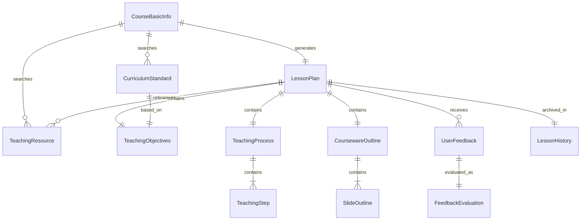

# 数据字典

> AI教师Agent项目数据对象定义
> 版本：v1.0
> 最后更新：2026-03-22

---

## 数据对象清单

| 对象ID | 对象名称 | 类别 | 状态 | 使用模块 |
|-------|---------|------|------|---------|
| DO-001 | CourseBasicInfo | 输入 | 已定义 | 智能备课助手 |
| DO-002 | CurriculumStandard | 领域 | 已定义 | 智能备课助手 |
| DO-003 | TeachingResource | 领域 | 已定义 | 智能备课助手 |
| DO-004 | TeachingObjectives | 领域 | 已定义 | 智能备课助手 |
| DO-005 | LessonPlan | 核心 | 已定义 | 智能备课助手 |
| DO-006 | TeachingProcess | 领域 | 已定义 | 智能备课助手 |
| DO-007 | TeachingStep | 领域 | 已定义 | 智能备课助手 |
| DO-008 | CoursewareOutline | 核心 | 已定义 | 智能备课助手 |
| DO-009 | SlideOutline | 领域 | 已定义 | 智能备课助手 |
| DO-010 | UserFeedback | 输入 | 已定义 | 智能备课助手 |
| DO-011 | FeedbackEvaluation | 核心 | 已定义 | 智能备课助手 |
| DO-012 | LessonHistory | 存储 | 已定义 | 智能备课助手 |

---

## DO-001: CourseBasicInfo (课程基本信息)

### 基本信息

- **对象ID**: DO-001
- **对象名称**: CourseBasicInfo
- **描述**: 用户输入的课程基本信息，是备课流程的起点
- **类别**: 输入对象

### 属性定义

| 属性名 | 类型 | 必填 | 默认值 | 约束 | 说明 |
|-------|------|-----|--------|------|------|
| education_level | str | 是 | - | 枚举:小学/初中/高中 | 学段 |
| subject | str | 是 | - | 长度1-20 | 学科名称 |
| topic | str | 是 | - | 长度2-100 | 教学主题 |
| grade | str | 否 | None | 如"高一"、"七年级" | 年级 |
| textbook_version | str | 否 | None | 如"人教版"、"北师大版" | 教材版本 |
| suggested_hours | int | 否 | 1 | ≥1 | 建议课时数 |
| input_timestamp | datetime | 是 | 当前时间 | - | 输入时间戳 |
| session_id | str | 是 | 自动生成 | UUID格式 | 会话标识 |

### 关系

| 关联对象 | 关系类型 | 关联字段 | 说明 |
|---------|---------|---------|------|
| CurriculumStandard | 1:N | (education_level, subject, topic) | 一个课程信息可对应多个课标 |
| LessonPlan | 1:1 | session_id | 一个课程信息生成一个教案 |

### 生命周期

- **创建**: 用户输入课程名称时创建
- **更新**: 不支持更新，错误时重新创建
- **删除**: 会话结束后保留历史记录

### 验证规则

```python
VALIDATION_RULES = {
    "education_level": {
        "type": "enum",
        "values": ["小学", "初中", "高中"],
        "error_message": "学段必须是小学、初中或高中"
    },
    "subject": {
        "type": "string",
        "min_length": 1,
        "max_length": 20,
        "error_message": "学科名称长度必须在1-20字符之间"
    },
    "topic": {
        "type": "string",
        "min_length": 2,
        "max_length": 100,
        "error_message": "主题长度必须在2-100字符之间"
    },
    "suggested_hours": {
        "type": "integer",
        "min": 1,
        "max": 10,
        "default": 1,
        "error_message": "课时数必须在1-10之间"
    }
}
```

### 示例

```python
{
    "education_level": "高中",
    "subject": "数学",
    "topic": "函数的概念",
    "grade": "高一",
    "textbook_version": "人教版",
    "suggested_hours": 2,
    "input_timestamp": "2026-03-22T10:30:00Z",
    "session_id": "550e8400-e29b-41d4-a716-446655440000"
}
```

---

## DO-002: CurriculumStandard (课程标准)

### 基本信息

- **对象ID**: DO-002
- **对象名称**: CurriculumStandard
- **描述**: 从国家或地方课程标准中提取的教学要求
- **类别**: 领域对象

### 属性定义

| 属性名 | 类型 | 必填 | 默认值 | 约束 | 说明 |
|-------|------|-----|--------|------|------|
| standard_id | str | 是 | - | UUID | 课标唯一标识 |
| standard_name | str | 是 | - | - | 课标文档名称 |
| standard_type | str | 是 | - | 枚举:国家/地方/校本 | 课标类型 |
| education_level | str | 是 | - | 小学/初中/高中 | 适用学段 |
| subject | str | 是 | - | - | 学科 |
| topic | str | 是 | - | - | 主题 |
| content_requirements | List[str] | 是 | - | 非空 | 内容要求列表 |
| competency_requirements | List[str] | 是 | - | 非空 | 素养要求列表 |
| achievement_standards | List[str] | 是 | - | 非空 | 学业质量标准 |
| suggested_hours | int | 是 | - | ≥1 | 建议课时 |
| source_url | str | 否 | None | URL格式 | 来源链接 |
| extracted_at | datetime | 是 | 当前时间 | - | 提取时间 |
| relevance_score | float | 是 | - | 0.0-1.0 | 相关度评分 |

### 关系

| 关联对象 | 关系类型 | 关联字段 | 说明 |
|---------|---------|---------|------|
| CourseBasicInfo | N:1 | (education_level, subject, topic) | 属于某个课程查询 |
| TeachingObjectives | 1:1 | standard_id | 基于课标生成目标 |

### 生命周期

- **创建**: 搜索课标时创建
- **更新**: 课标版本更新时更新
- **删除**: 不删除，保留历史版本

### 验证规则

```python
VALIDATION_RULES = {
    "standard_type": {
        "type": "enum",
        "values": ["国家", "地方", "校本"]
    },
    "content_requirements": {
        "type": "list",
        "min_items": 1,
        "item_type": "string"
    },
    "relevance_score": {
        "type": "float",
        "min": 0.0,
        "max": 1.0
    }
}
```

### 示例

```python
{
    "standard_id": "std-001",
    "standard_name": "普通高中数学课程标准（2017年版2020年修订）",
    "standard_type": "国家",
    "education_level": "高中",
    "subject": "数学",
    "topic": "函数的概念",
    "content_requirements": [
        "在初中用变量之间的依赖关系描述函数的基础上，用集合语言和对应关系刻画函数，建立完整的函数概念",
        "体会集合语言和对应关系在刻画函数概念中的作用"
    ],
    "competency_requirements": [
        "数学抽象：从具体实例中抽象出函数概念",
        "逻辑推理：理解函数定义的逻辑结构"
    ],
    "achievement_standards": [
        "能够理解函数的概念，用集合语言描述函数",
        "能够判断两个函数是否相同"
    ],
    "suggested_hours": 2,
    "source_url": "http://www.moe.gov.cn/...",
    "extracted_at": "2026-03-22T10:30:05Z",
    "relevance_score": 0.95
}
```

---

## DO-003: TeachingResource (教学资源)

### 基本信息

- **对象ID**: DO-003
- **对象名称**: TeachingResource
- **描述**: 从网络搜索获取的教学资源（教案、课件、习题等）
- **类别**: 领域对象

### 属性定义

| 属性名 | 类型 | 必填 | 默认值 | 约束 | 说明 |
|-------|------|-----|--------|------|------|
| resource_id | str | 是 | - | UUID | 资源唯一标识 |
| resource_type | str | 是 | - | 枚举:教案/课件/习题/素材 | 资源类型 |
| title | str | 是 | - | - | 资源标题 |
| source_platform | str | 是 | - | - | 来源平台 |
| source_url | str | 是 | - | URL | 原始链接 |
| author | str | 否 | None | - | 作者 |
| content_summary | str | 是 | - | - | 内容摘要 |
| content_full | str | 否 | None | - | 完整内容（如允许）|
| file_format | str | 否 | None | 如"docx", "pptx" | 文件格式 |
| download_url | str | 否 | None | URL | 下载链接 |
| education_level | str | 是 | - | - | 适用学段 |
| subject | str | 是 | - | - | 学科 |
| topic | str | 是 | - | - | 主题 |
| quality_score | float | 是 | - | 0.0-1.0 | 质量评分 |
| relevance_score | float | 是 | - | 0.0-1.0 | 相关度评分 |
| usage_count | int | 是 | 0 | ≥0 | 被引用次数 |
| collected_at | datetime | 是 | 当前时间 | - | 采集时间 |

### 关系

| 关联对象 | 关系类型 | 关联字段 | 说明 |
|---------|---------|---------|------|
| CourseBasicInfo | N:1 | (education_level, subject, topic) | 属于某个课程查询 |
| LessonPlan | N:M | resource_id | 被教案引用参考 |

### 生命周期

- **创建**: 网络搜索时创建
- **更新**: 质量评分更新、使用次数增加
- **删除**: 质量过低或版权问题时删除

### 验证规则

```python
VALIDATION_RULES = {
    "resource_type": {
        "type": "enum",
        "values": ["教案", "课件", "习题", "素材"]
    },
    "quality_score": {
        "type": "float",
        "min": 0.0,
        "max": 1.0
    },
    "relevance_score": {
        "type": "float",
        "min": 0.0,
        "max": 1.0
    }
}
```

### 示例

```python
{
    "resource_id": "res-001",
    "resource_type": "教案",
    "title": "函数的概念教学设计（一等奖）",
    "source_platform": "学科网",
    "source_url": "https://www.zxxk.com/...",
    "author": "张老师",
    "content_summary": "本教案通过生活实例引入函数概念，设计了探究活动...",
    "education_level": "高中",
    "subject": "数学",
    "topic": "函数的概念",
    "quality_score": 0.88,
    "relevance_score": 0.92,
    "usage_count": 0,
    "collected_at": "2026-03-22T10:30:10Z"
}
```

---

## DO-004: TeachingObjectives (教学目标)

### 基本信息

- **对象ID**: DO-004
- **对象名称**: TeachingObjectives
- **描述**: 三维教学目标（知识与技能、过程与方法、情感态度价值观）
- **类别**: 领域对象

### 属性定义

| 属性名 | 类型 | 必填 | 默认值 | 约束 | 说明 |
|-------|------|-----|--------|------|------|
| objectives_id | str | 是 | - | UUID | 目标集标识 |
| lesson_plan_id | str | 是 | - | UUID | 所属教案 |
| knowledge_goals | List[str] | 是 | - | 2-4项 | 知识与技能目标 |
| ability_goals | List[str] | 是 | - | 2-4项 | 过程与方法目标 |
| quality_goals | List[str] | 是 | - | 2-4项 | 情感态度价值观目标 |
| key_points | List[str] | 是 | - | 1-3项 | 教学重点 |
| difficult_points | List[str] | 是 | - | 1-3项 | 教学难点 |
| generated_at | datetime | 是 | 当前时间 | - | 生成时间 |
| based_on_standard | str | 是 | - | UUID | 基于的课标 |

### 关系

| 关联对象 | 关系类型 | 关联字段 | 说明 |
|---------|---------|---------|------|
| LessonPlan | 1:1 | lesson_plan_id | 属于某个教案 |
| CurriculumStandard | N:1 | based_on_standard | 基于课标生成 |

### 生命周期

- **创建**: 生成教学目标时创建
- **更新**: 用户反馈修改时更新
- **删除**: 教案删除时级联删除

### 验证规则

```python
VALIDATION_RULES = {
    "knowledge_goals": {
        "type": "list",
        "min_items": 2,
        "max_items": 4,
        "item_type": "string"
    },
    "ability_goals": {
        "type": "list",
        "min_items": 2,
        "max_items": 4,
        "item_type": "string"
    },
    "quality_goals": {
        "type": "list",
        "min_items": 2,
        "max_items": 4,
        "item_type": "string"
    },
    "key_points": {
        "type": "list",
        "min_items": 1,
        "max_items": 3,
        "item_type": "string"
    },
    "difficult_points": {
        "type": "list",
        "min_items": 1,
        "max_items": 3,
        "item_type": "string"
    }
}
```

### 示例

```python
{
    "objectives_id": "obj-001",
    "lesson_plan_id": "lp-001",
    "knowledge_goals": [
        "理解函数的概念，能用集合语言和对应关系刻画函数",
        "掌握函数的三要素，能判断两个函数是否相同",
        "了解函数的不同表示方法（解析法、列表法、图象法）"
    ],
    "ability_goals": [
        "通过实例分析，培养数学抽象能力",
        "通过函数判断，培养逻辑推理能力",
        "通过实际应用，培养数学建模能力"
    ],
    "quality_goals": [
        "体会数学概念的严谨性和抽象性",
        "感受函数思想在描述现实世界变化规律中的作用",
        "培养主动探究、合作交流的学习习惯"
    ],
    "key_points": [
        "函数概念的理解",
        "函数三要素的把握"
    ],
    "difficult_points": [
        "函数符号y=f(x)的理解",
        "抽象函数概念的形成过程"
    ],
    "generated_at": "2026-03-22T10:31:00Z",
    "based_on_standard": "std-001"
}
```

---

## DO-005: LessonPlan (教案)

### 基本信息

- **对象ID**: DO-005
- **对象名称**: LessonPlan
- **描述**: 完整的教案文档，包含所有教学要素
- **类别**: 核心对象

### 属性定义

| 属性名 | 类型 | 必填 | 默认值 | 约束 | 说明 |
|-------|------|-----|--------|------|------|
| lesson_plan_id | str | 是 | - | UUID | 教案唯一标识 |
| session_id | str | 是 | - | UUID | 关联会话 |
| course_info | CourseBasicInfo | 是 | - | - | 课程基本信息 |
| objectives | TeachingObjectives | 是 | - | - | 教学目标 |
| teaching_process | TeachingProcess | 是 | - | - | 教学过程 |
| courseware | CoursewareOutline | 是 | - | - | 课件大纲 |
| referenced_resources | List[str] | 是 | [] | - | 引用的资源ID列表 |
| blackboard_design | str | 否 | None | - | 板书设计 |
| homework_design | List[Dict] | 是 | [] | - | 作业设计 |
| teaching_reflection | str | 否 | None | - | 教学反思预设 |
| version | str | 是 | "1.0" | 语义化版本 | 版本号 |
| status | str | 是 | "draft" | 枚举 | 状态 |
| created_at | datetime | 是 | 当前时间 | - | 创建时间 |
| updated_at | datetime | 是 | 当前时间 | - | 更新时间 |
| created_by | str | 是 | - | - | 创建者 |
| approved_by | str | 否 | None | - | 审核者 |

### 关系

| 关联对象 | 关系类型 | 关联字段 | 说明 |
|---------|---------|---------|------|
| CourseBasicInfo | 1:1 | course_info | 基于课程信息生成 |
| TeachingObjectives | 1:1 | objectives | 包含教学目标 |
| TeachingProcess | 1:1 | teaching_process | 包含教学过程 |
| CoursewareOutline | 1:1 | courseware | 包含课件大纲 |
| TeachingResource | N:M | referenced_resources | 引用的资源 |

### 生命周期

- **创建**: 备课流程完成时创建
- **更新**: 用户反馈修改时更新，版本号递增
- **删除**: 用户删除或归档

### 状态流转

```
draft(草稿) → reviewing(审核中) → approved(已批准) → published(已发布)
                    ↓
              rejected(已拒绝)
```

### 验证规则

```python
VALIDATION_RULES = {
    "status": {
        "type": "enum",
        "values": ["draft", "reviewing", "approved", "published", "rejected", "archived"]
    },
    "version": {
        "type": "string",
        "pattern": r"^\d+\.\d+$"
    },
    "referenced_resources": {
        "type": "list",
        "item_type": "string"
    }
}
```

### 示例

```python
{
    "lesson_plan_id": "lp-001",
    "session_id": "550e8400-e29b-41d4-a716-446655440000",
    "course_info": {...},  # CourseBasicInfo对象
    "objectives": {...},   # TeachingObjectives对象
    "teaching_process": {...},  # TeachingProcess对象
    "courseware": {...},   # CoursewareOutline对象
    "referenced_resources": ["res-001", "res-002"],
    "blackboard_design": "主板书：函数概念...",
    "homework_design": [
        {"level": "基础", "content": "..."},
        {"level": "提高", "content": "..."},
        {"level": "拓展", "content": "..."}
    ],
    "teaching_reflection": "预设反思要点...",
    "version": "1.0",
    "status": "draft",
    "created_at": "2026-03-22T10:35:00Z",
    "updated_at": "2026-03-22T10:35:00Z",
    "created_by": "system",
    "approved_by": None
}
```

---

## DO-006: TeachingProcess (教学过程)

### 基本信息

- **对象ID**: DO-006
- **对象名称**: TeachingProcess
- **描述**: 完整的课堂教学流程，包含多个教学步骤
- **类别**: 领域对象

### 属性定义

| 属性名 | 类型 | 必填 | 默认值 | 约束 | 说明 |
|-------|------|-----|--------|------|------|
| process_id | str | 是 | - | UUID | 过程标识 |
| lesson_plan_id | str | 是 | - | UUID | 所属教案 |
| steps | List[TeachingStep] | 是 | - | 5-8步 | 教学步骤列表 |
| total_duration | int | 是 | - | 40-45 | 总时长（分钟）|
| teaching_methods | List[str] | 是 | - | - | 教学方法 |
| teaching_aids | List[str] | 否 | [] | - | 教学用具 |
| design_intent | str | 否 | None | - | 整体设计意图 |

### 关系

| 关联对象 | 关系类型 | 关联字段 | 说明 |
|---------|---------|---------|------|
| LessonPlan | 1:1 | lesson_plan_id | 属于某个教案 |
| TeachingStep | 1:N | steps | 包含多个步骤 |

### 生命周期

- **创建**: 设计教学过程时创建
- **更新**: 用户反馈修改时更新
- **删除**: 教案删除时级联删除

### 验证规则

```python
VALIDATION_RULES = {
    "steps": {
        "type": "list",
        "min_items": 5,
        "max_items": 8,
        "item_type": "TeachingStep"
    },
    "total_duration": {
        "type": "integer",
        "min": 40,
        "max": 45,
        "error_message": "课时长度应在40-45分钟"
    }
}
```

### 示例

```python
{
    "process_id": "proc-001",
    "lesson_plan_id": "lp-001",
    "steps": [
        {...},  # TeachingStep对象
        {...},
        {...}
    ],
    "total_duration": 45,
    "teaching_methods": ["启发式教学", "探究式学习", "小组合作"],
    "teaching_aids": ["多媒体课件", "函数模型教具"],
    "design_intent": "通过生活实例引入，层层递进..."
}
```

---

## DO-007: TeachingStep (教学步骤)

### 基本信息

- **对象ID**: DO-007
- **对象名称**: TeachingStep
- **描述**: 教学过程中的单个步骤
- **类别**: 领域对象

### 属性定义

| 属性名 | 类型 | 必填 | 默认值 | 约束 | 说明 |
|-------|------|-----|--------|------|------|
| step_id | str | 是 | - | UUID | 步骤标识 |
| step_number | int | 是 | - | 1-8 | 步骤序号 |
| step_name | str | 是 | - | - | 步骤名称 |
| step_type | str | 是 | - | 枚举 | 步骤类型 |
| duration | int | 是 | - | ≥1 | 时长（分钟）|
| teacher_activities | List[str] | 是 | - | - | 教师活动 |
| student_activities | List[str] | 是 | - | - | 学生活动 |
| design_intent | str | 是 | - | - | 设计意图 |
| key_points | List[str] | 否 | [] | - | 本步骤要点 |
| materials_needed | List[str] | 否 | [] | - | 所需材料 |

### 步骤类型枚举

```python
STEP_TYPES = [
    "导入",           # 课堂导入
    "新授",           # 新课讲授
    "探究",           # 探究活动
    "演示",           # 演示实验
    "练习",           # 课堂练习
    "讨论",           # 小组讨论
    "小结",           # 课堂小结
    "作业"            # 布置作业
]
```

### 验证规则

```python
VALIDATION_RULES = {
    "step_type": {
        "type": "enum",
        "values": STEP_TYPES
    },
    "duration": {
        "type": "integer",
        "min": 1,
        "max": 20,
        "error_message": "单步骤时长应在1-20分钟"
    }
}
```

### 示例

```python
{
    "step_id": "step-001",
    "step_number": 1,
    "step_name": "情境导入",
    "step_type": "导入",
    "duration": 5,
    "teacher_activities": [
        "展示生活中函数关系的实例图片",
        "提出问题：这些例子有什么共同特点？"
    ],
    "student_activities": [
        "观察图片，思考教师提出的问题",
        "尝试用自己的语言描述关系"
    ],
    "design_intent": "从生活实例出发，激发学习兴趣，为抽象概念做铺垫",
    "key_points": ["实例选择要贴近学生生活"],
    "materials_needed": ["PPT课件", "生活实例图片"]
}
```

---

## DO-008: CoursewareOutline (课件大纲)

### 基本信息

- **对象ID**: DO-008
- **对象名称**: CoursewareOutline
- **描述**: PPT课件的结构大纲
- **类别**: 核心对象

### 属性定义

| 属性名 | 类型 | 必填 | 默认值 | 约束 | 说明 |
|-------|------|-----|--------|------|------|
| outline_id | str | 是 | - | UUID | 大纲标识 |
| lesson_plan_id | str | 是 | - | UUID | 所属教案 |
| slides | List[SlideOutline] | 是 | - | 15-25页 | 幻灯片列表 |
| total_slides | int | 是 | - | 15-25 | 总页数 |
| design_theme | str | 是 | - | - | 设计风格 |
| color_scheme | str | 否 | None | - | 配色方案 |
| font_style | str | 否 | None | - | 字体风格 |

### 关系

| 关联对象 | 关系类型 | 关联字段 | 说明 |
|---------|---------|---------|------|
| LessonPlan | 1:1 | lesson_plan_id | 属于某个教案 |
| SlideOutline | 1:N | slides | 包含多个幻灯片 |

### 验证规则

```python
VALIDATION_RULES = {
    "slides": {
        "type": "list",
        "min_items": 15,
        "max_items": 25,
        "item_type": "SlideOutline"
    },
    "total_slides": {
        "type": "integer",
        "min": 15,
        "max": 25
    }
}
```

### 示例

```python
{
    "outline_id": "cw-001",
    "lesson_plan_id": "lp-001",
    "slides": [
        {...},  # SlideOutline对象
        {...}
    ],
    "total_slides": 20,
    "design_theme": "简洁学术风",
    "color_scheme": "蓝白配色",
    "font_style": "微软雅黑"
}
```

---

## DO-009: SlideOutline (幻灯片大纲)

### 基本信息

- **对象ID**: DO-009
- **对象名称**: SlideOutline
- **描述**: 单页幻灯片的内容大纲
- **类别**: 领域对象

### 属性定义

| 属性名 | 类型 | 必填 | 默认值 | 约束 | 说明 |
|-------|------|-----|--------|------|------|
| slide_id | str | 是 | - | UUID | 幻灯片标识 |
| slide_number | int | 是 | - | ≥1 | 页码 |
| slide_type | str | 是 | - | 枚举 | 页面类型 |
| title | str | 是 | - | - | 页面标题 |
| content_points | List[str] | 是 | - | - | 内容要点 |
| layout_type | str | 是 | - | 枚举 | 建议布局 |
| materials_needed | List[Dict] | 否 | [] | - | 所需素材 |
| speaker_notes | str | 否 | None | - | 讲稿备注 |
| corresponding_step | str | 否 | None | UUID | 对应教学步骤 |

### 页面类型枚举

```python
SLIDE_TYPES = [
    "封面",       # 标题页
    "目录",       # 目录页
    "导入",       # 导入页
    "内容",       # 内容页
    "图表",       # 图表页
    "例题",       # 例题页
    "练习",       # 练习页
    "总结",       # 总结页
    "作业"        # 作业页
]
```

### 布局类型枚举

```python
LAYOUT_TYPES = [
    "title_only",       # 仅标题
    "title_content",    # 标题+内容
    "title_two_col",    # 标题+双栏
    "title_image",      # 标题+图片
    "title_chart",      # 标题+图表
    "full_image",       # 全屏图片
    "comparison"        # 对比布局
]
```

### 示例

```python
{
    "slide_id": "slide-001",
    "slide_number": 1,
    "slide_type": "封面",
    "title": "函数的概念",
    "content_points": [
        "高中数学必修第一册",
        "第三章 函数的概念与性质"
    ],
    "layout_type": "title_only",
    "materials_needed": [],
    "speaker_notes": "上课开始，展示课题",
    "corresponding_step": None
}
```

---

## DO-010: UserFeedback (用户反馈)

### 基本信息

- **对象ID**: DO-010
- **对象名称**: UserFeedback
- **描述**: 用户对教案或课件的反馈
- **类别**: 输入对象

### 属性定义

| 属性名 | 类型 | 必填 | 默认值 | 约束 | 说明 |
|-------|------|-----|--------|------|------|
| feedback_id | str | 是 | - | UUID | 反馈标识 |
| session_id | str | 是 | - | UUID | 关联会话 |
| lesson_plan_id | str | 是 | - | UUID | 关联教案 |
| feedback_type | str | 是 | - | 枚举 | 反馈类型 |
| target_section | str | 否 | None | - | 针对章节 |
| content | str | 是 | - | 长度≥5 | 反馈内容 |
| suggested_change | str | 否 | None | - | 建议修改 |
| priority | str | 是 | "normal" | 枚举 | 优先级 |
| submitted_at | datetime | 是 | 当前时间 | - | 提交时间 |
| submitted_by | str | 是 | - | - | 提交者 |

### 反馈类型枚举

```python
FEEDBACK_TYPES = [
    "modify",       # 修改建议
    "add",          # 增加内容
    "delete",       # 删除内容
    "comment",      # 一般评论
    "approve",      # 确认通过
    "reject"        # 整体拒绝
]
```

### 优先级枚举

```python
PRIORITY_LEVELS = [
    "low",      # 低
    "normal",   # 普通
    "high",     # 高
    "urgent"    # 紧急
]
```

### 示例

```python
{
    "feedback_id": "fb-001",
    "session_id": "550e8400-e29b-41d4-a716-446655440000",
    "lesson_plan_id": "lp-001",
    "feedback_type": "modify",
    "target_section": "教学目标",
    "content": "需要增加实际应用的目标",
    "suggested_change": "能够运用函数概念解决实际问题",
    "priority": "normal",
    "submitted_at": "2026-03-22T10:40:00Z",
    "submitted_by": "张老师"
}
```

---

## DO-011: FeedbackEvaluation (反馈评估)

### 基本信息

- **对象ID**: DO-011
- **对象名称**: FeedbackEvaluation
- **描述**: 对用户反馈的智能评估结果
- **类别**: 核心对象

### 属性定义

| 属性名 | 类型 | 必填 | 默认值 | 约束 | 说明 |
|-------|------|-----|--------|------|------|
| evaluation_id | str | 是 | - | UUID | 评估标识 |
| feedback_id | str | 是 | - | UUID | 关联反馈 |
| decision | str | 是 | - | 枚举 | 处理决策 |
| confidence | float | 是 | - | 0.0-1.0 | 置信度 |
| relevance_score | float | 是 | - | 0.0-1.0 | 相关性评分 |
| feasibility_score | float | 是 | - | 0.0-1.0 | 可行性评分 |
| reasoning | str | 是 | - | - | 评估理由 |
| alternative_suggestion | str | 否 | None | - | 替代建议 |
| evaluated_at | datetime | 是 | 当前时间 | - | 评估时间 |
| evaluated_by | str | 是 | "system" | - | 评估者 |

### 决策枚举

```python
DECISION_TYPES = [
    "accepted",             # 接受
    "rejected",             # 拒绝
    "needs_clarification",  # 需要澄清
    "partial_accepted",     # 部分接受
    "pending_review"        # 待人工复核
]
```

### 评估规则

```python
EVALUATION_RULES = {
    "relevance_threshold": 0.5,      # 相关性阈值
    "feasibility_threshold": 0.3,    # 可行性阈值
    "confidence_threshold": 0.7,     # 置信度阈值
    "auto_accept_threshold": 0.8,    # 自动接受阈值
    "auto_reject_threshold": 0.2     # 自动拒绝阈值
}
```

### 示例

```python
{
    "evaluation_id": "eval-001",
    "feedback_id": "fb-001",
    "decision": "accepted",
    "confidence": 0.85,
    "relevance_score": 0.82,
    "feasibility_score": 0.90,
    "reasoning": "反馈内容与教学目标章节高度相关，建议具体可行，符合课程标准要求",
    "alternative_suggestion": None,
    "evaluated_at": "2026-03-22T10:40:05Z",
    "evaluated_by": "system"
}
```

---

## DO-012: LessonHistory (备课历史)

### 基本信息

- **对象ID**: DO-012
- **对象名称**: LessonHistory
- **描述**: 备课会话的历史记录
- **类别**: 存储对象

### 属性定义

| 属性名 | 类型 | 必填 | 默认值 | 约束 | 说明 |
|-------|------|-----|--------|------|------|
| history_id | str | 是 | - | UUID | 历史记录标识 |
| session_id | str | 是 | - | UUID | 会话标识 |
| course_info | CourseBasicInfo | 是 | - | - | 课程信息 |
| lesson_plan | LessonPlan | 是 | - | - | 最终教案 |
| feedback_history | List[Dict] | 是 | [] | - | 反馈历史 |
| version_history | List[Dict] | 是 | [] | - | 版本历史 |
| completion_status | str | 是 | - | 枚举 | 完成状态 |
| created_at | datetime | 是 | 当前时间 | - | 创建时间 |
| completed_at | datetime | 否 | None | - | 完成时间 |
| created_by | str | 是 | - | - | 创建者 |

### 完成状态枚举

```python
COMPLETION_STATUSES = [
    "in_progress",      # 进行中
    "completed",        # 已完成
    "abandoned",        # 已放弃
    "archived"          # 已归档
]
```

### 示例

```python
{
    "history_id": "hist-001",
    "session_id": "550e8400-e29b-41d4-a716-446655440000",
    "course_info": {...},
    "lesson_plan": {...},
    "feedback_history": [
        {"feedback_id": "fb-001", "decision": "accepted", "at": "2026-03-22T10:40:05Z"}
    ],
    "version_history": [
        {"version": "1.0", "at": "2026-03-22T10:35:00Z"},
        {"version": "1.1", "at": "2026-03-22T10:41:00Z"}
    ],
    "completion_status": "completed",
    "created_at": "2026-03-22T10:30:00Z",
    "completed_at": "2026-03-22T10:45:00Z",
    "created_by": "张老师"
}
```

---

## 数据对象关系图



---

## 变更历史

| 版本 | 日期 | 变更内容 | 变更人 |
|-----|------|---------|--------|
| v1.0 | 2026-03-22 | 初始版本，定义12个数据对象 | 开发团队 |
