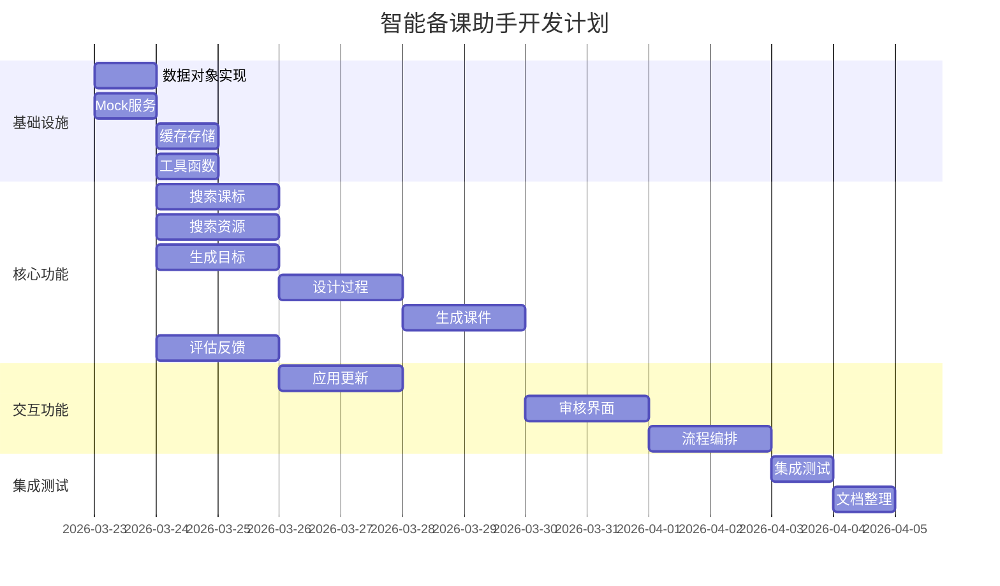

# 任务计划：智能备课助手

> 项目：AI教师Agent
> 模块：智能备课助手 (REQ-LP-001)
> 计划版本：v1.0
> 创建日期：2026-03-22
> 预计工期：4周

---

## 任务总览

| 阶段 | 任务数 | 预计工时 | 时间范围 |
|-----|-------|---------|---------|
| 阶段1：基础设施 | 4 | 16h | 第1周 |
| 阶段2：核心功能 | 6 | 32h | 第2-3周 |
| 阶段3：交互功能 | 3 | 16h | 第3-4周 |
| 阶段4：集成测试 | 2 | 8h | 第4周 |
| **总计** | **15** | **72h** | **4周** |

---

## 阶段1：基础设施（第1周）

### 任务1.1：数据对象实现

- **任务ID**: TASK-001
- **任务名称**: 实现所有数据对象(DO-001至DO-012)
- **类型**: 实现
- **优先级**: P0
- **预计工时**: 4h
- **前置任务**: 无

**输入产物**:
- 数据字典文档 (docs/data_dictionary.md)

**输出产物**:
- `src/models/course_basic_info.py`
- `src/models/curriculum_standard.py`
- `src/models/teaching_resource.py`
- `src/models/teaching_objectives.py`
- `src/models/lesson_plan.py`
- `src/models/teaching_process.py`
- `src/models/teaching_step.py`
- `src/models/courseware_outline.py`
- `src/models/slide_outline.py`
- `src/models/user_feedback.py`
- `src/models/feedback_evaluation.py`
- `src/models/lesson_history.py`

**验收标准**:
- [ ] 所有数据对象类实现完成
- [ ] 每个类包含验证方法
- [ ] 单元测试覆盖率≥90%
- [ ] 所有测试通过

---

### 任务1.2：外部依赖Mock服务

- **任务ID**: TASK-002
- **任务名称**: 实现外部依赖Mock服务
- **类型**: 实现
- **优先级**: P0
- **预计工时**: 4h
- **前置任务**: 无

**输入产物**:
- 需求文档中的外部依赖分析

**输出产物**:
- `src/mocks/search_service_mock.py` (EXT-001)
- `src/mocks/llm_service_mock.py` (EXT-002)
- `src/mocks/standard_db_mock.py` (EXT-003)

**验收标准**:
- [ ] Mock服务实现完成
- [ ] 支持预设测试数据
- [ ] 支持延迟和错误模拟
- [ ] 单元测试通过

---

### 任务1.3：缓存和存储基础设施

- **任务ID**: TASK-003
- **任务名称**: 实现缓存和存储基础设施
- **类型**: 实现
- **优先级**: P0
- **预计工时**: 4h
- **前置任务**: 无

**输出产物**:
- `src/infrastructure/cache.py`
- `src/infrastructure/storage.py`
- `src/infrastructure/database.py`

**验收标准**:
- [ ] 缓存读写功能正常
- [ ] 本地存储功能正常
- [ ] 数据库连接功能正常
- [ ] 单元测试通过

---

### 任务1.4：工具函数库

- **任务ID**: TASK-004
- **任务名称**: 实现通用工具函数
- **类型**: 实现
- **优先级**: P0
- **预计工时**: 4h
- **前置任务**: 无

**输出产物**:
- `src/utils/validators.py` (验证函数)
- `src/utils/text_utils.py` (文本处理)
- `src/utils/uuid_utils.py` (UUID生成)
- `src/utils/logger.py` (日志工具)

**验收标准**:
- [ ] 所有工具函数实现完成
- [ ] 单元测试覆盖率≥90%
- [ ] 所有测试通过

---

## 阶段2：核心功能（第2-3周）

### 任务2.1：搜索课程标准(FP-LP-001)

- **任务ID**: TASK-005
- **任务名称**: 实现搜索课程标准功能
- **类型**: 实现
- **优先级**: P0
- **预计工时**: 6h
- **前置任务**: TASK-001, TASK-002, TASK-003, TASK-004

**输入产物**:
- 函数规格: FN-LP-001-搜索课程标准.md

**输出产物**:
- `src/skills/lesson_preparation/search_standard.py`
- `tests/skills/test_search_standard.py`

**开发步骤**:
1. [ ] 编写测试代码和测试数据 (1h)
2. [ ] 实现输入验证函数 (0.5h)
3. [ ] 实现搜索查询构建 (0.5h)
4. [ ] 实现课标解析函数 (1h)
5. [ ] 实现相关度计算 (0.5h)
6. [ ] 实现主搜索函数 (1h)
7. [ ] 运行测试并修复 (1.5h)

**验收标准**:
- [ ] 测试代码先于实现完成
- [ ] 所有测试用例通过
- [ ] 覆盖率≥90%
- [ ] 文档已更新

---

### 任务2.2：搜索网络资源(FP-LP-002)

- **任务ID**: TASK-006
- **任务名称**: 实现搜索网络教学资源功能
- **类型**: 实现
- **优先级**: P0
- **预计工时**: 5h
- **前置任务**: TASK-001, TASK-002, TASK-004

**输入产物**:
- 需求文档中的FP-LP-002规格

**输出产物**:
- `src/skills/lesson_preparation/search_resources.py`
- `tests/skills/test_search_resources.py`

**开发步骤**:
1. [ ] 编写测试代码 (1h)
2. [ ] 实现资源搜索 (1.5h)
3. [ ] 实现资源解析 (1h)
4. [ ] 实现质量评分 (0.5h)
5. [ ] 运行测试并修复 (1h)

---

### 任务2.3：生成教学目标(FP-LP-003)

- **任务ID**: TASK-007
- **任务名称**: 实现生成教学目标功能
- **类型**: 实现
- **优先级**: P0
- **预计工时**: 5h
- **前置任务**: TASK-001, TASK-002

**输出产物**:
- `src/skills/lesson_preparation/generate_objectives.py`
- `tests/skills/test_generate_objectives.py`

**开发步骤**:
1. [ ] 编写测试代码 (1h)
2. [ ] 实现目标生成 (2h)
3. [ ] 实现重难点提取 (1h)
4. [ ] 运行测试并修复 (1h)

---

### 任务2.4：设计教学过程(FP-LP-004)

- **任务ID**: TASK-008
- **任务名称**: 实现设计教学过程功能
- **类型**: 实现
- **优先级**: P0
- **预计工时**: 6h
- **前置任务**: TASK-001, TASK-007

**输出产物**:
- `src/skills/lesson_preparation/design_process.py`
- `tests/skills/test_design_process.py`

**开发步骤**:
1. [ ] 编写测试代码 (1h)
2. [ ] 实现教学步骤生成 (2h)
3. [ ] 实现时间分配 (1h)
4. [ ] 实现活动设计 (1h)
5. [ ] 运行测试并修复 (1h)

---

### 任务2.5：生成课件结构(FP-LP-005)

- **任务ID**: TASK-009
- **任务名称**: 实现生成课件结构功能
- **类型**: 实现
- **优先级**: P0
- **预计工时**: 5h
- **前置任务**: TASK-001, TASK-008

**输出产物**:
- `src/skills/lesson_preparation/generate_courseware.py`
- `tests/skills/test_generate_courseware.py`

**开发步骤**:
1. [ ] 编写测试代码 (1h)
2. [ ] 实现幻灯片生成 (2h)
3. [ ] 实现布局建议 (1h)
4. [ ] 运行测试并修复 (1h)

---

### 任务2.6：评估用户反馈(FP-LP-007)

- **任务ID**: TASK-010
- **任务名称**: 实现评估用户反馈功能
- **类型**: 实现
- **优先级**: P0
- **预计工时**: 5h
- **前置任务**: TASK-001, TASK-004

**输入产物**:
- 函数规格: FN-LP-007-评估用户反馈.md

**输出产物**:
- `src/skills/lesson_preparation/evaluate_feedback.py`
- `tests/skills/test_evaluate_feedback.py`

**开发步骤**:
1. [ ] 编写测试代码 (1h)
2. [ ] 实现基础有效性检查 (1h)
3. [ ] 实现相关性评估 (1h)
4. [ ] 实现可行性评估 (0.5h)
5. [ ] 实现决策逻辑 (0.5h)
6. [ ] 运行测试并修复 (1h)

---

## 阶段3：交互功能（第3-4周）

### 任务3.1：应用反馈更新(FP-LP-008)

- **任务ID**: TASK-011
- **任务名称**: 实现应用反馈更新功能
- **类型**: 实现
- **优先级**: P0
- **预计工时**: 5h
- **前置任务**: TASK-010

**输出产物**:
- `src/skills/lesson_preparation/apply_feedback.py`
- `tests/skills/test_apply_feedback.py`

**开发步骤**:
1. [ ] 编写测试代码 (1h)
2. [ ] 实现更新逻辑 (2h)
3. [ ] 实现版本管理 (1h)
4. [ ] 运行测试并修复 (1h)

---

### 任务3.2：展示审核界面(FP-LP-006)

- **任务ID**: TASK-012
- **任务名称**: 实现展示审核界面功能
- **类型**: 实现
- **优先级**: P0
- **预计工时**: 6h
- **前置任务**: TASK-005至TASK-009

**输出产物**:
- `src/ui/lesson_review_ui.py`
- `templates/lesson_review.html`
- `tests/ui/test_review_ui.py`

**开发步骤**:
1. [ ] 编写测试代码 (1h)
2. [ ] 实现界面渲染 (2h)
3. [ ] 实现交互组件 (2h)
4. [ ] 运行测试并修复 (1h)

---

### 任务3.3：主流程编排

- **任务ID**: TASK-013
- **任务名称**: 实现备课主流程编排
- **类型**: 实现
- **优先级**: P0
- **预计工时**: 5h
- **前置任务**: TASK-005至TASK-012

**输出产物**:
- `src/skills/lesson_preparation/orchestrator.py`
- `tests/skills/test_orchestrator.py`

**开发步骤**:
1. [ ] 编写测试代码 (1h)
2. [ ] 实现流程编排 (2h)
3. [ ] 实现状态管理 (1h)
4. [ ] 运行测试并修复 (1h)

---

## 阶段4：集成测试（第4周）

### 任务4.1：集成测试

- **任务ID**: TASK-014
- **任务名称**: 执行集成测试
- **类型**: 测试
- **优先级**: P0
- **预计工时**: 4h
- **前置任务**: TASK-005至TASK-013

**输出产物**:
- `tests/integration/test_lesson_preparation.py`
- `docs/test_reports/INTEGRATION_TEST-001.md`

**测试内容**:
1. [ ] 完整备课流程测试
2. [ ] 反馈处理流程测试
3. [ ] 错误恢复测试
4. [ ] 性能测试

---

### 任务4.2：文档整理

- **任务ID**: TASK-015
- **任务名称**: 整理项目文档
- **类型**: 文档
- **优先级**: P1
- **预计工时**: 4h
- **前置任务**: TASK-014

**输出产物**:
- `docs/README.md` (项目说明)
- `docs/API.md` (API文档)
- `docs/CHANGELOG.md` (变更日志)

---

## 任务依赖图

---

## 风险与应对

| 风险 | 可能性 | 影响 | 应对措施 |
|-----|-------|------|---------|
| Mock服务与实际服务差异大 | 中 | 高 | 早期设计可替换接口 |
| LLM服务不稳定 | 高 | 中 | 实现规则降级方案 |
| 测试覆盖率不达标 | 中 | 中 | 预留修复时间 |
| 性能不达标 | 低 | 高 | 预留优化时间 |

---

## 每日站会检查项

1. 昨日完成任务
2. 今日计划任务
3. 阻塞/依赖问题
4. 测试通过率
5. 覆盖率数据

---

## 变更历史

| 版本 | 日期 | 变更内容 | 变更人 |
|-----|------|---------|--------|
| v1.0 | 2026-03-22 | 初始版本 | 开发团队 |
