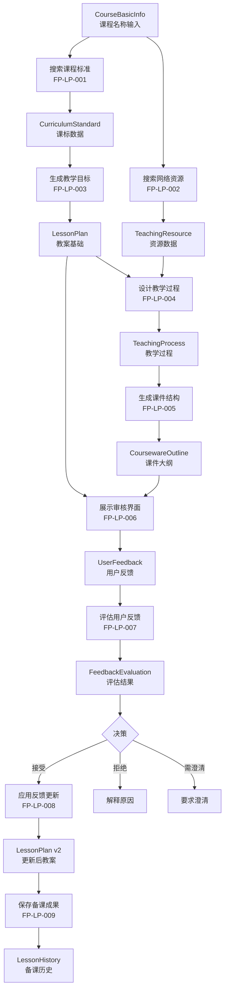

# 需求文档：智能备课助手

## 需求标识

- **需求ID**: REQ-LP-001
- **需求名称**: 智能备课助手
- **优先级**: P0（关键）
- **状态**: 已批准
- **创建日期**: 2026-03-22
- **最后更新**: 2026-03-22

---

## 1. 需求描述

### 1.1 业务背景

教师备课是一项复杂、耗时的工作，需要：
1. 查阅课程标准和教材
2. 搜索和整合网络教学资源
3. 撰写符合标准的教案
4. 制作教学课件
5. 设计练习题和作业

当前教师平均花费 3-5 小时准备一堂优质课程，且资源分散、质量参差不齐。

### 1.2 用户价值

**目标用户**：中小学教师（主要）、教育机构教师

**核心价值**：
- ⏱️ 将备课时间从 3-5 小时缩短到 10-30 分钟
- 📚 自动整合优质网络资源，避免重复劳动
- ✅ 确保输出符合课程标准要求
- 🔄 支持迭代优化，持续改进教学质量

### 1.3 需求范围

**包含范围**:
1. 基于课程名称自动搜索课程标准
2. 搜索和整合网络教学资源（教案、课件、习题）
3. 生成符合课标的三维教学目标
4. 设计完整教学过程（导入→新授→练习→小结→作业）
5. 生成课件结构和大纲
6. 提供用户审核界面
7. 智能处理用户反馈（接受/拒绝/需要澄清）
8. 根据反馈自动更新教案

**排除范围**:
- 实际PPT文件的生成（仅提供结构和内容大纲）
- 视频/音频素材的制作
- 学生端的实时授课功能（属于REQ-LP-002）
- 多语言教学支持（后续版本）

---

## 2. 用户场景

### 场景1: 快速备课

**参与者**: 中学数学教师张老师

**前置条件**:
- 张老师已登录系统
- 系统已配置网络搜索能力
- 系统已连接LLM服务

**主流程**:
1. 张老师输入"高中数学 函数的概念"
2. 系统自动搜索高中数学课程标准中关于函数的要求
3. 系统搜索网络优质教案和课件资源
4. 系统生成符合课标的完整教案（含教学目标、重难点、教学过程）
5. 系统生成课件结构大纲
6. 系统展示生成结果给张老师审核
7. 张老师提出修改意见："增加实际应用的例子"
8. 系统评估反馈为"合理可接受"
9. 系统自动更新教案，增加应用案例
10. 张老师确认满意，导出教案和课件大纲

**后置条件**:
- 教案已保存到教师个人资源库
- 课件大纲可用于后续PPT制作
- 本次备课记录进入系统记忆

**异常流程**:
- E1: 网络搜索失败 → 使用本地缓存数据或提示用户手动输入
- E2: 课标未找到 → 提示用户确认课程名称或手动上传课标
- E3: 用户反馈不合理 → 系统解释原因，建议替代方案

### 场景2: 处理不合理反馈

**参与者**: 中学数学教师张老师

**主流程**:
1. 张老师查看生成的教案
2. 张老师输入反馈："加入量子力学内容"（与高中函数无关）
3. 系统评估反馈相关性：0.1分（低于阈值0.5）
4. 系统判断为"不相关反馈"
5. 系统回复："您的建议与当前课程主题'函数的概念'关联度较低。建议：1) 聚焦函数的实际应用场景；2) 或明确您希望拓展的具体方向。"
6. 张老师重新输入："增加函数在经济中的应用例子"
7. 系统评估相关性：0.8分
8. 系统接受反馈并更新教案

---

## 3. 功能需求

### 3.1 功能点清单

| 功能点ID | 功能点名称 | 优先级 | 状态 | 依赖 |
|---------|-----------|--------|------|------|
| FP-LP-001 | 搜索课程标准 | P0 | 待实现 | DO-001, DO-002, EXT-001 |
| FP-LP-002 | 搜索网络教学资源 | P0 | 待实现 | DO-001, DO-003, EXT-001 |
| FP-LP-003 | 生成教学目标 | P0 | 待实现 | DO-002, DO-004, EXT-002 |
| FP-LP-004 | 设计教学过程 | P0 | 待实现 | DO-004, DO-005, EXT-002 |
| FP-LP-005 | 生成课件结构 | P0 | 待实现 | DO-005, DO-006, EXT-002 |
| FP-LP-006 | 展示审核界面 | P0 | 待实现 | DO-007, DO-008 |
| FP-LP-007 | 评估用户反馈 | P0 | 待实现 | DO-008, DO-009, EXT-002 |
| FP-LP-008 | 应用反馈更新 | P0 | 待实现 | DO-004, DO-008, DO-009 |
| FP-LP-009 | 保存备课成果 | P1 | 待实现 | DO-010 |
| FP-LP-010 | 管理备课历史 | P1 | 待实现 | DO-010 |

### 3.2 功能点详细说明

#### FP-LP-001: 搜索课程标准

**功能描述**:
根据课程名称（学段+学科+主题）搜索对应的课程标准文档，提取相关的教学要求、内容标准、学业质量标准。

**输入**:
| 字段 | 类型 | 必填 | 约束 | 说明 |
|-----|------|-----|------|------|
| education_level | str | 是 | 小学/初中/高中 | 学段 |
| subject | str | 是 | 学科名称 | 如"数学"、"语文" |
| topic | str | 是 | 长度2-50 | 具体主题，如"函数的概念" |

**输出**:
| 字段 | 类型 | 说明 |
|-----|------|------|
| standard_id | str | 课标文档ID |
| standard_name | str | 课标名称 |
| content_requirements | List[str] | 内容要求列表 |
| competency_requirements | List[str] | 素养要求列表 |
| achievement_standards | List[str] | 学业质量标准 |
| suggested_hours | int | 建议课时 |

**业务规则**:
- BR-001: 优先搜索国家课程标准，其次地方标准
- BR-002: 如未找到精确匹配，返回最相关的章节
- BR-003: 提取的内容必须包含"内容要求"和"学业质量"两部分

---

#### FP-LP-002: 搜索网络教学资源

**功能描述**:
搜索网络上已有的优质教案、课件、习题资源，作为生成参考。

**输入**:
| 字段 | 类型 | 必填 | 约束 | 说明 |
|-----|------|-----|------|------|
| education_level | str | 是 | 小学/初中/高中 | 学段 |
| subject | str | 是 | 学科名称 | 学科 |
| topic | str | 是 | - | 主题 |
| resource_types | List[str] | 否 | [lesson_plan, ppt, exercise] | 资源类型筛选 |

**输出**:
| 字段 | 类型 | 说明 |
|-----|------|------|
| resources | List[Resource] | 资源列表 |
| total_found | int | 找到的资源总数 |
| sources | List[str] | 来源网站列表 |

**业务规则**:
- BR-004: 优先选择教育部门官网、知名教育平台的资源
- BR-005: 资源必须包含完整内容，不只是标题
- BR-006: 记录来源用于引用和版权检查

---

#### FP-LP-003: 生成教学目标

**功能描述**:
基于课程标准，生成三维教学目标（知识与技能、过程与方法、情感态度与价值观）。

**输入**:
| 字段 | 类型 | 必填 | 说明 |
|-----|------|-----|------|
| content_requirements | List[str] | 是 | 课标内容要求 |
| competency_requirements | List[str] | 是 | 课标素养要求 |
| topic | str | 是 | 教学主题 |

**输出**:
| 字段 | 类型 | 说明 |
|-----|------|------|
| knowledge_goals | List[str] | 知识与技能目标 |
| ability_goals | List[str] | 过程与方法目标 |
| quality_goals | List[str] | 情感态度价值观目标 |
| key_points | List[str] | 教学重点 |
| difficult_points | List[str] | 教学难点 |

**业务规则**:
- BR-007: 目标必须使用可观测的行为动词（理解、掌握、运用等）
- BR-008: 目标数量：每维2-3条，总共6-9条
- BR-009: 重难点必须与课标要求对应

---

#### FP-LP-004: 设计教学过程

**功能描述**:
设计完整的课堂教学流程，包括各环节的时间分配、师生活动、设计意图。

**输入**:
| 字段 | 类型 | 必填 | 说明 |
|-----|------|-----|------|
| teaching_objectives | TeachingObjectives | 是 | 教学目标对象 |
| key_points | List[str] | 是 | 教学重点 |
| difficult_points | List[str] | 是 | 教学难点 |
| suggested_hours | int | 是 | 建议课时 |
| reference_resources | List[Resource] | 否 | 参考资源 |

**输出**:
| 字段 | 类型 | 说明 |
|-----|------|------|
| teaching_process | List[TeachingStep] | 教学步骤列表 |
| total_duration | int | 总时长（分钟） |
| teaching_methods | List[str] | 使用的教学方法 |

**业务规则**:
- BR-010: 必须包含：导入、新授、练习、小结、作业五个基本环节
- BR-011: 每环节必须有明确的时间分配（分钟）
- BR-012: 每环节必须说明师生活动和设计意图

---

#### FP-LP-005: 生成课件结构

**功能描述**:
生成PPT课件的结构大纲，包括每页的内容要点、建议布局、素材需求。

**输入**:
| 字段 | 类型 | 必填 | 说明 |
|-----|------|-----|------|
| teaching_process | List[TeachingStep] | 是 | 教学过程 |
| teaching_objectives | TeachingObjectives | 是 | 教学目标 |

**输出**:
| 字段 | 类型 | 说明 |
|-----|------|------|
| slides | List[SlideOutline] | 课件页面列表 |
| total_slides | int | 总页数 |
| design_theme | str | 建议设计风格 |

**业务规则**:
- BR-013: 页数建议：每课时15-25页
- BR-014: 每页必须有明确的内容要点
- BR-015: 标注需要的素材类型（图片、图表、视频等）

---

#### FP-LP-006: 展示审核界面

**功能描述**:
将生成的教案和课件结构以结构化、可视化的方式展示给用户审核。

**输入**:
| 字段 | 类型 | 必填 | 说明 |
|-----|------|-----|------|
| lesson_plan | LessonPlan | 是 | 完整教案对象 |
| courseware_outline | CoursewareOutline | 是 | 课件大纲对象 |

**输出**:
| 字段 | 类型 | 说明 |
|-----|------|------|
| ui_html | str | 界面HTML（如为Web）|
| ui_structure | Dict | 界面结构数据 |

**业务规则**:
- BR-016: 界面必须分节展示，支持折叠展开
- BR-017: 必须提供反馈输入区域
- BR-018: 必须显示生成来源和引用

---

#### FP-LP-007: 评估用户反馈

**功能描述**:
智能评估用户反馈的合理性、相关性、可行性，决定如何处理。

**输入**:
| 字段 | 类型 | 必填 | 说明 |
|-----|------|-----|------|
| feedback_text | str | 是 | 用户反馈文本 |
| feedback_type | str | 是 | modify/add/delete/comment |
| target_section | str | 否 | 反馈针对的章节 |
| current_lesson_plan | LessonPlan | 是 | 当前教案 |

**输出**:
| 字段 | 类型 | 说明 |
|-----|------|------|
| evaluation_result | FeedbackEvaluation | 评估结果 |
| decision | str | accepted/clarification_needed/rejected |
| confidence | float | 置信度0-1 |
| reasoning | str | 评估理由 |

**业务规则**:
- BR-019: 相关性阈值：≥0.5为相关，<0.5为不相关
- BR-020: 必须解释拒绝原因并提供替代建议
- BR-021: 模糊反馈必须要求澄清

---

#### FP-LP-008: 应用反馈更新

**功能描述**:
根据评估通过的反馈，自动更新教案或课件结构。

**输入**:
| 字段 | 类型 | 必填 | 说明 |
|-----|------|-----|------|
| lesson_plan | LessonPlan | 是 | 原教案 |
| feedback | UserFeedback | 是 | 用户反馈（已评估）|
| evaluation | FeedbackEvaluation | 是 | 评估结果 |

**输出**:
| 字段 | 类型 | 说明 |
|-----|------|------|
| updated_lesson_plan | LessonPlan | 更新后的教案 |
| changes_made | List[str] | 变更列表 |
| version | str | 新版本号 |

**业务规则**:
- BR-022: 更新前必须保存原版本
- BR-023: 记录所有变更用于追溯
- BR-024: 更新后必须重新验证课标符合性

---

## 4. 非功能需求

### 4.1 性能要求

- **响应时间**: 单次备课生成 ≤ 60秒（不含用户审核时间）
- **并发支持**: 支持10个教师同时备课
- **资源加载**: 网络资源搜索 ≤ 15秒

### 4.2 安全要求

- **数据安全**: 教师备课数据加密存储
- **版权合规**: 引用的网络资源必须标注来源
- **内容安全**: 生成内容必须符合教育规范

### 4.3 可用性要求

- **易用性**: 教师无需培训即可使用
- **容错性**: 网络失败时有降级方案
- **可恢复性**: 支持断点续传和草稿保存

---

## 5. 依赖分析

### 5.1 内部依赖

| 依赖ID | 依赖名称 | 状态 | 影响 |
|-------|---------|------|------|
| DO-001 | CourseBasicInfo | 待定义 | 所有功能的基础输入 |
| DO-002 | CurriculumStandard | 待定义 | FP-LP-001, FP-LP-003 |
| DO-003 | TeachingResource | 待定义 | FP-LP-002 |
| DO-004 | LessonPlan | 待定义 | FP-LP-003, FP-LP-004, FP-LP-008 |
| DO-005 | TeachingProcess | 待定义 | FP-LP-004, FP-LP-005 |
| DO-006 | CoursewareOutline | 待定义 | FP-LP-005 |
| DO-007 | UIRenderer | 待定义 | FP-LP-006 |
| DO-008 | UserFeedback | 待定义 | FP-LP-007, FP-LP-008 |
| DO-009 | FeedbackEvaluation | 待定义 | FP-LP-007, FP-LP-008 |
| DO-010 | LessonHistory | 待定义 | FP-LP-009, FP-LP-010 |

**未就绪依赖处理**:
所有DO对象需要在本需求实现前完成设计，转化为数据对象设计任务。

### 5.2 外部依赖

| 依赖名称 | 类型 | 状态 | 降级方案 |
|---------|------|------|---------|
| EXT-001 | 网络搜索API | 未就绪 | 使用本地缓存数据库 |
| EXT-002 | LLM服务 | 未就绪 | 使用规则模板生成 |
| EXT-003 | 课标数据库 | 未就绪 | 用户手动上传 |

**未就绪外部依赖处理**:
- EXT-001, EXT-002, EXT-003 需要开发Mock服务用于测试
- 生产环境需要配置真实服务连接

---

## 6. 数据对象

### 6.1 涉及数据对象

| 对象ID | 对象名称 | 定义位置 | 说明 |
|-------|---------|---------|------|
| DO-001 | CourseBasicInfo | docs/data_dictionary.md | 课程基本信息 |
| DO-002 | CurriculumStandard | docs/data_dictionary.md | 课程标准 |
| DO-003 | TeachingResource | docs/data_dictionary.md | 教学资源 |
| DO-004 | LessonPlan | docs/data_dictionary.md | 教案 |
| DO-005 | TeachingProcess | docs/data_dictionary.md | 教学过程 |
| DO-006 | CoursewareOutline | docs/data_dictionary.md | 课件大纲 |
| DO-007 | UIRenderer | docs/data_dictionary.md | UI渲染器 |
| DO-008 | UserFeedback | docs/data_dictionary.md | 用户反馈 |
| DO-009 | FeedbackEvaluation | docs/data_dictionary.md | 反馈评估 |
| DO-010 | LessonHistory | docs/data_dictionary.md | 备课历史 |

### 6.2 数据流图

---

## 7. 验收标准

### 7.1 功能验收

- [ ] AC1: 输入"高中数学 函数的概念"，60秒内生成完整教案
- [ ] AC2: 教案包含三维教学目标、重难点、完整教学过程
- [ ] AC3: 课件大纲包含15-25页，每页有明确内容要点
- [ ] AC4: 用户输入合理反馈，系统正确更新教案
- [ ] AC5: 用户输入不合理反馈，系统正确拒绝并解释
- [ ] AC6: 网络失败时，系统有降级方案继续工作

### 7.2 测试验收

- [ ] AC7: 单元测试覆盖率 ≥ 90%
- [ ] AC8: 所有功能点测试用例通过
- [ ] AC9: 集成测试通过（完整备课流程）
- [ ] AC10: 性能测试通过（响应时间≤60秒）

---

## 8. 变更历史

| 版本 | 日期 | 变更内容 | 变更人 |
|-----|------|---------|--------|
| v1.0 | 2026-03-22 | 初始版本 | 开发团队 |

---

## 9. 附录

### 9.1 参考文档
- 《Agent开发指南》第2章：Context和Prompt管理
- 《Agent开发指南》第5章：Agent Skills定义和组织
- 《Agent开发指南》第6-7章：记忆系统

### 9.2 相关需求
- REQ-LP-002: 实时授课助手（后续开发）
