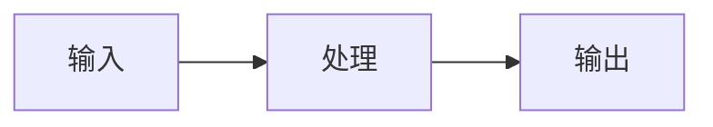

# 需求文档模板

## 需求标识

- **需求ID**: REQ-[系统]-[模块]-[序号]
- **需求名称**: [Name]
- **优先级**: P0(关键) / P1(重要) / P2(一般) / P3(可选)
- **状态**: 草稿 / 评审中 / 已批准 / 已实现 / 已验收
- **创建日期**: YYYY-MM-DD
- **最后更新**: YYYY-MM-DD

---

## 1. 需求描述

### 1.1 业务背景
[描述这个需求的业务背景和动机]

### 1.2 用户价值
[描述这个需求为用户带来什么价值]

### 1.3 需求范围

**包含范围**:
- [功能点1]
- [功能点2]

**排除范围**:
- [明确不包含的功能]

---

## 2. 用户场景

### 场景1: [场景名称]

**参与者**: [用户角色]

**前置条件**:
- [条件1]
- [条件2]

**主流程**:
1. [步骤1]
2. [步骤2]
3. [步骤3]

**后置条件**:
- [结果状态]

**异常流程**:
- E1: [异常情况] → [处理方式]

---

## 3. 功能需求

### 3.1 功能点清单

| 功能点ID | 功能点名称 | 优先级 | 状态 | 依赖 |
|---------|-----------|--------|------|------|
| FP-XXX | [名称] | P0 | 待实现 | [依赖ID] |

### 3.2 功能点详细说明

#### FP-XXX: [功能点名称]

**功能描述**:
[详细描述]

**输入**:
| 字段 | 类型 | 必填 | 约束 | 说明 |
|-----|------|-----|------|------|
| [字段名] | [类型] | 是/否 | [约束] | [说明] |

**输出**:
| 字段 | 类型 | 说明 |
|-----|------|------|
| [字段名] | [类型] | [说明] |

**业务规则**:
- [规则1]
- [规则2]

---

## 4. 非功能需求

### 4.1 性能要求
- [性能指标]

### 4.2 安全要求
- [安全要求]

### 4.3 可用性要求
- [可用性要求]

---

## 5. 依赖分析

### 5.1 内部依赖

| 依赖ID | 依赖名称 | 状态 | 影响 |
|-------|---------|------|------|
| [ID] | [名称] | 已就绪/未就绪 | [说明] |

### 5.2 外部依赖

| 依赖名称 | 类型 | 状态 | 降级方案 |
|---------|------|------|---------|
| [名称] | API/库/服务 | 已就绪/未就绪 | [方案] |

### 5.3 未就绪依赖处理

[列出未就绪依赖如何转化为新需求]

---

## 6. 数据对象

### 6.1 涉及数据对象

| 对象ID | 对象名称 | 定义位置 | 说明 |
|-------|---------|---------|------|
| DO-XXX | [名称] | [文件路径] | [说明] |

### 6.2 数据流图

---

## 7. 验收标准

### 7.1 功能验收

- [ ] AC1: [验收条件1]
- [ ] AC2: [验收条件2]

### 7.2 测试验收

- [ ] 单元测试覆盖率 ≥ 90%
- [ ] 所有测试用例通过

---

## 8. 变更历史

| 版本 | 日期 | 变更内容 | 变更人 |
|-----|------|---------|--------|
| v0.1 | YYYY-MM-DD | 初始版本 | [姓名] |

---

## 9. 附录

### 9.1 参考文档
- [文档链接]

### 9.2 相关需求
- [需求ID]
